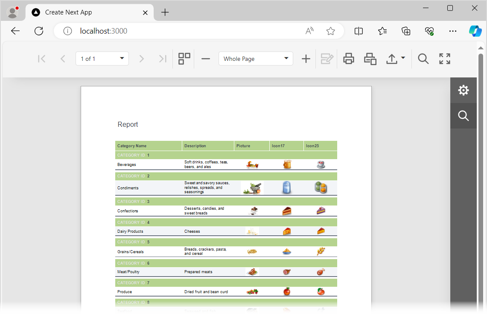

<!-- default badges list -->

[](https://supportcenter.devexpress.com/ticket/details/T848272)
[](https://docs.devexpress.com/GeneralInformation/403183)
[](#does-this-example-address-your-development-requirementsobjectives)
<!-- default badges end -->
# Reporting for React -  Add a Web Document Viewer to a React App

This example incorporates the Web Document Viewer into a client-side app built with React. The example consists of two parts:

- The [ServerSideApp](ServerSideApp) folder contains the backend project. The project is an ASP.NET Core application that enables [cross-domain requests (CORS)](https://developer.mozilla.org/en-US/docs/Web/HTTP/CORS) (Access-Control-Allow-Origin) and implements custom web report storage.


- The [react-document-viewer](react-document-viewer) folder contains the client application built with React.

## Quick Start

### Server

In the *ServerSideApp/ServerSideApp* folder, run the following command:


```
dotnet run
```

The server starts at http://localhost:5000. To debug the server, run the application in Visual Studio.

### Client

In the *react-document-viewer* folder, run the following commands:

```
npm install
npm run dev
```

Open `http://localhost:3000/` in your browser to view the result. The application displays the Web Document Viewer with the *TestReport* report.




## Files to Review

- [page.tsx](react-document-viewer/app/page.tsx)
- [Program.cs](ServerSideApp/ServerSideApp/Program.cs)
- [ReportingControllers.cs](ServerSideApp/ServerSideApp/Controllers/ReportingControllers.cs)

## Documentation

- [Create a React Application with Web Document Viewer](https://docs.devexpress.com/XtraReports/119338)
- [Document Viewer Server-Side Configuration (ASP.NET Core)](https://docs.devexpress.com/XtraReports/400197)

## More Examples

* [Reporting for React - Integrate Report Designer in React App](https://github.com/DevExpress-Examples/reporting-eud-designer-in-javascript-with-react)

## Customization Examples

This project contains code snippets used for client-side customization and reflected in our online help topics. Each code snippet is enclosed in a `page.tsx` file in a separate folder. After running the project, open the following folders to see the result:

| Location | Description |
| --- | --- |
| /custom-export-to-button | Hides the [Export Options panel](https://devexpress.github.io/dotnet-eud/reporting-for-web/articles/document-viewer/exporting/export-a-document.html), adds a button to export the report to a file in XLSX format, and specifies the `Author` export option. |
| /custom-parameter-lookup-source | Populates parameter editors with values obtained on the client. |
| /customize-export-options | Specifies the "&#124;"" symbol as a separator for CSV data export. |
| /customize-export-toolbar-item | Adds a new `Image: JPEG` item in the Export drop-down menu and binds it to the `ExportTo` action.
| /customize-parameter-editor-options | Removes time part from a calendar editor in the Parameters panel. | 
| /export-options-hide-format | Removes the `XLS` format from the **Export To** drop-down list and from the **Export Options** panel.
| /get-parameters-model | Obtains values that the user selects in the multi-value parameter editor. | 
| /get-preview-model | Collapses the tab panel when the user clicks **Reset** in the **Parameters** tab. |
| /goto-next-page | Automatically navigates through the document pages. |
| /open-report | Loads the specified report. |
| /parameters-events | Handles report parameter events. |
| /property-changes-processing | Sets the zoom level to 25%, enables multi-page mode, and indicates the moment when the first page is loaded. |
| /submit-parameters | Passes a parameter to the report and rebuilds the document. |


<!-- feedback -->
## Does this example address your development requirements/objectives?

[](https://www.devexpress.com/support/examples/survey.xml?utm_source=github&utm_campaign=reporting-react-integrate-web-document-viewer&~~~was_helpful=yes) [](https://www.devexpress.com/support/examples/survey.xml?utm_source=github&utm_campaign=reporting-react-integrate-web-document-viewer&~~~was_helpful=no)

(you will be redirected to DevExpress.com to submit your response)
<!-- feedback end -->
